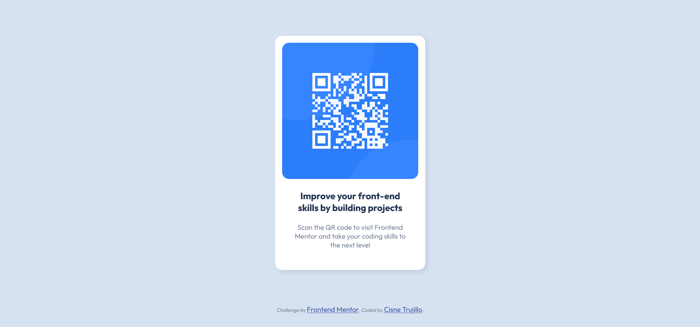

# Frontend Mentor - QR code component solution

This is a solution to the [QR code component challenge on Frontend Mentor](https://www.frontendmentor.io/challenges/qr-code-component-iux_sIO_H). Frontend Mentor challenges help you improve your coding skills by building realistic projects. 

## Table of contents

  - [Screenshot](#screenshot)
  - [Links](#links)
- [My process](#my-process)
  - [Built with](#built-with)
  - [What I learned](#what-i-learned)
  - [Continued development](#continued-development)
- [Author](#author)
- [Acknowledgments](#acknowledgments)

### Screenshot

### Links

- Solution URL: [https://github.com/cisneConCorbata/frontendMentor-QR](https://github.com/cisneConCorbata/frontendMentor-QR)
- Live Site URL: [https://cisneconcorbata.github.io/frontendMentor-QR/](https://cisneconcorbata.github.io/frontendMentor-QR/)

## My process

- Started out with HTML only until every element was on screen
- Applied general styles to * and body tags
- Applied specific styles to specific tags and styles
- Adapted the width to fit correctly in different screens

### Built with

- Semantic HTML5 markup
- CSS custom properties
- Flexbox

### What I learned

- How to create GitHub repositories and pages

### Continued development

I will continue learning ways to center vertically since the method I use normally doesn't work to center entire sections.

## Author

- Frontend Mentor - [@cisneConCorbata](https://www.frontendmentor.io/profile/cisneConCorbata)
- Twitter - [@cisneConCorbata](https://www.twitter.com/cisneConCorbata)

## Acknowledgments

- [@kkhwjnrk](https://www.frontendmentor.io/profile/kkhwjnrk) for helping me with vertical alignment
- [@0xAbdul](https://www.frontendmentor.io/profile/0xAbdul) for helping me with accessibility issues
